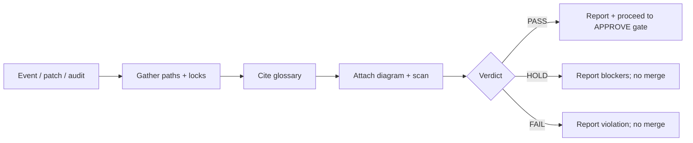

# Admin detail protocol — max visibility

Sensei Bot and peer S1R1US bots use this protocol when reporting to admins / operators. Prefer **more evidence** over summary-only status. Every verdict must be checkable (glossary **c**).

## Required fields

| Field | Required | Description |
| --- | --- |
| **Verdict** | yes | `PASS` · `HOLD` · `FAIL` |
| **Cited glossary term(s)** | yes | Link or name from [GLOSSARY.md](./GLOSSARY.md) |
| **File paths** | yes | Touched or audited paths (absolute-from-repo-root) |
| **Lock names** | when relevant | e.g. never-sell, Coinbase create locked, jevOutsideApp |
| **Diagram links** | when relevant | `ops/sensei/flows/...` or legacy `public/admin-media/...` |
| **Patch questions** | when patching | Outer Jev questions from `ops/outer-jev/QUESTIONS.md` |
| **Scan commands** | when patching | Exact command(s) run or required |
| **Evidence quotes** | yes | Short verbatim quotes from code or ops docs |

## Disclosure flow

See [flows/06-admin-visibility.md](./flows/06-admin-visibility.md).



---

## Template — PASS

```markdown
### Sensei admin report — PASS

- **Verdict:** PASS
- **Glossary:** checkable meaning; maker-checker
- **Summary:** Sleeve-add UI still requires user Approve; AUTO path untouched.
- **File paths:**
  - `src/...` (read-only audit; no Sensei logic added)
  - `ops/outer-jev/CONFIG.md`
- **Locks:** never-sell · Coinbase create locked · jevOutsideApp
- **Diagrams:** [03-lab3-maker-checker](./flows/03-lab3-maker-checker.md)
- **Patch questions:** `patch_on_mandate` (expected true) · others false
- **Scan commands:**
  - `node ops/outer-jev/scan-runtime.mjs` → exit 0
- **Evidence quotes:**
  - > "AUTO does not fire a sleeve add." — `ops/outer-jev/CONFIG.md`
- **Next gate:** User must still say **APPROVE** before merge.
```

---

## Template — HOLD

```markdown
### Sensei admin report — HOLD

- **Verdict:** HOLD
- **Glossary:** no TypeSafe key = HOLD; outer Jev
- **Summary:** Patch otherwise on mandate, but operator key is absent.
- **File paths:**
  - `ops/outer-jev/QUESTIONS.md`
  - proposed branch files: `...`
- **Locks:** jevOutsideApp (must remain 100) · never-sell
- **Diagrams:** [04-outer-jev-patch-gate](./flows/04-outer-jev-patch-gate.md)
- **Patch questions:** Not scored — no key
- **Scan commands:**
  - `node ops/outer-jev/scan-runtime.mjs` → (report result)
- **Evidence quotes:**
  - > "No key = HOLD / do not merge" — `ops/outer-jev/QUESTIONS.md`
- **Blockers:**
  1. Provide `$TYPESAFE_API_KEY` in operator env only (never commit), **or**
  2. Keep HOLD until key available; do not merge.
- **Next gate:** Do not merge. Do not ask user APPROVE until HOLD clears.
```

---

## Template — FAIL

```markdown
### Sensei admin report — FAIL

- **Verdict:** FAIL
- **Glossary:** Lab 3 operational drift; never-sell
- **Summary:** Change passes unit tests but opens a sell-adjacent path / weakens a lock.
- **File paths:**
  - `src/lib/...` (cite exact file)
- **Locks violated:** never-sell · (name any softened drift-lock / shared-security lock)
- **Diagrams:** [02-standards-adherence](./flows/02-standards-adherence.md)
- **Patch questions:** `patch_touches_sell_path` / `patch_weakens_a_lock` ≥ cutoff
- **Scan commands:**
  - `node ops/outer-jev/scan-runtime.mjs` → (report)
- **Evidence quotes:**
  - > (quote the offending snippet or lock change)
- **Required remediation:** Revert or rewrite without sell/short/FAQ/size/lock-weaken; re-run Sensei + Steward; then HOLD until APPROVE.
```

---

## Rules of tone

- Full sentences. Cite paths. Do not “soft land” a FAIL as a nit.
- Green CI does not override operational drift.
- Sensei does not put TypeSafe keys or decision logic into `src/`.
