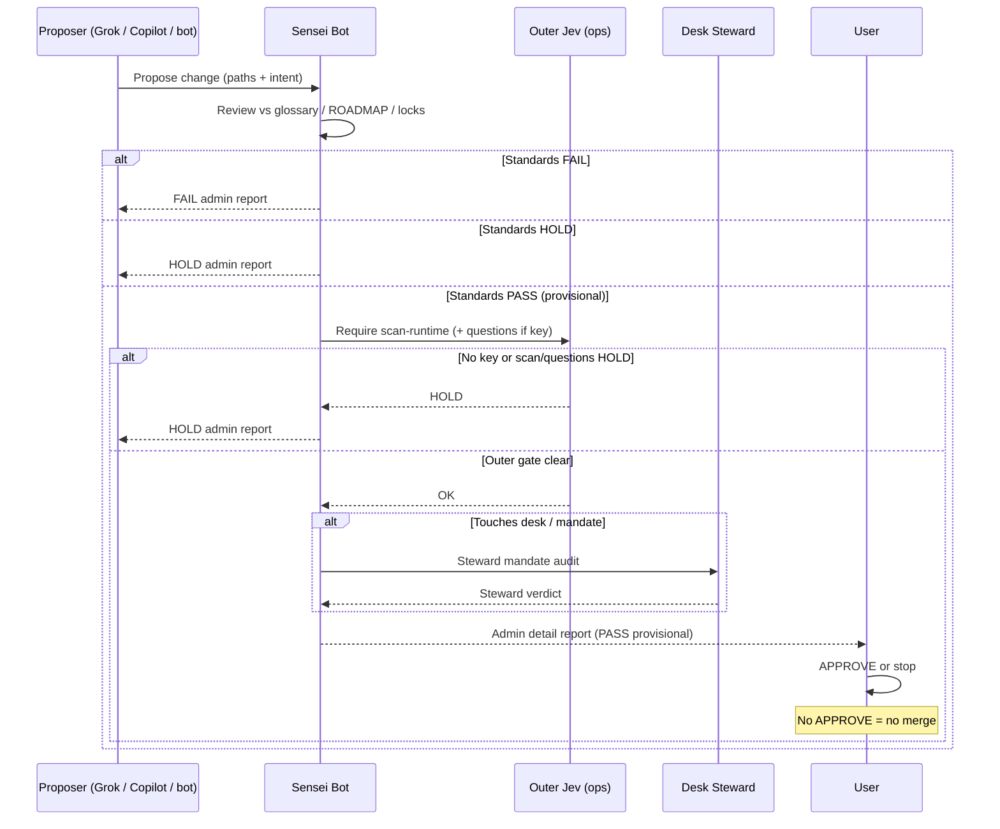

# Bot interface — Sensei ↔ S1R1US bots

How Sensei Bot App aligns **functionality** and **design** across S1R1US bots without owning desk runtime.

## Actors

| Actor | Role |
| --- | --- |
| **Sensei Bot** (`d40cd9e7-579d-4fc6-b860-60143c9d0b42`) | Standards guardian (glossary, roadmap, locks, admin detail). |
| **Grok Bot** | Teammate executor; proposes and implements under Sensei + Steward rules. |
| **Lab 3 Desk Steward** | Mandate / inventory authority for desk changes. |
| **GitHub Copilot / patch agents** | Propose patches; never self-merge. |
| **Outer Jev** | Ops-only patch scorer (`ops/outer-jev/`); not a product bot inside `src/`. |
| **User / admin** | Final **APPROVE** for merge. |

## Canonical sequence

### Steps (checklist)

1. **Propose** — bot/agent states intent, file list, and whether desk gates are touched.
2. **Sensei review** — against [GLOSSARY.md](./GLOSSARY.md), [ROADMAP.md](./ROADMAP.md), hard locks; emit [ADMIN-DETAIL](./ADMIN-DETAIL.md) fields.
3. **Outer Jev gate** — hard rules (no model) → `node ops/outer-jev/scan-runtime.mjs` → if key: `node ops/outer-jev/score-patch.mjs --state state.json`; **no key = HOLD**.
4. **Steward mandate audit** — if desk/mandate surface is involved.
5. **User APPROVE** — required for merge to main. Sensei never substitutes for APPROVE.

## Design alignment

- Shared vocabulary: glossary a+b+c.
- Shared visuals: [flows/](./flows/INDEX.md) + legacy PNGs in `public/admin-media/`.
- Shared ops layout: Sensei and Jev both live under `ops/`, never imported by `src/`.
- Desk bots keep maker-checker UX; Sensei does not add in-app Jev or AUTO sleeve fire.

## Functionality alignment

| Concern | Owner | Sensei role |
| --- | --- | --- |
| Sleeve Approve/Deny | Desk UI + Steward | Verify gates match Checkpoint 152 |
| CLIP / bot ON conditions | Desk logic | Cite; do not rewrite in Sensei docs as code |
| Patch leak scan | Outer Jev | Require before merge |
| Standards language | Sensei | Source of truth in `ops/sensei/` |
| Live site | Out of scope | Refuse writes to s1r1us.ai from Lab 3 work |

## Canonical diagram

See [flows/07-lab3-bot-workflow.md](./flows/07-lab3-bot-workflow.md). Skill: `lab-3-sensei-workflow`.

## Anti-patterns

- Skipping Sensei because “tests pass.”
- Putting Sensei or TypeSafe into `src/`.
- Treating Steward or Copilot APPROVE as user APPROVE.
- Weakening never-sell / Coinbase create / FAQ / size locks for convenience.
