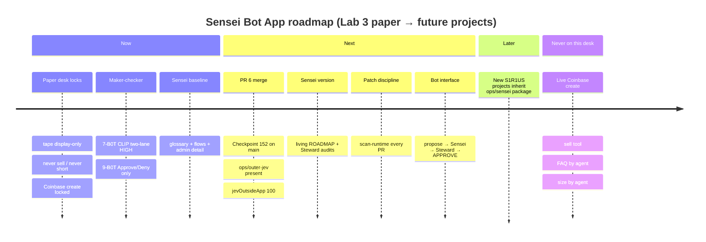

# Sensei Bot App — living roadmap

> Paper desk only. This roadmap does **not** write to https://s1r1us.ai.  
> Sensei version for Checkpoint 152+ · package home: `ops/sensei/`  
> **Accuracy:** Checkpoint 152 / `ops/outer-jev/` are **pending PR #6** (not on `main` yet). Marked `[~]` until #6 merges.

Scannable status legend:

| Marker | Meaning |
| --- | --- |
| `[x]` | In force / done on paper Lab 3 |
| `[~]` | Active / in progress |
| `[ ]` | Planned |
| `[!]` | Hard never on **this** desk |

---

## Timeline (Mermaid)

---

## Now — Lab 3 paper desk (in force on main)

Inherited from Lab 3 sandbox chats and ROADMAP-141 (Checkpoint 152 desk changes are **not** on `main` until PR #6 merges):

- `[x]` **Paper desk only** — not live s1r1us.ai
- `[x]` **Tape display only** — not a trade instruction
- `[x]` **7-B0T CLIP** — two-lane HIGH + 7 ON + bots 1–6 ON
- `[x]` **9-B0T sleeve add** — user **Approve** or **Deny**; **AUTO does not fire**
- `[x]` **Never sell / never short / Coinbase create locked**
- `[x]` **No FAQ by agent / no size picking by agent**
- `[x]` **Communication standards a+b+c** — glossary + Lab 3 operational drift + checkable meaning ([GLOSSARY.md](./GLOSSARY.md))
- `[x]` **Sensei Bot App baseline** landed under `ops/sensei/` (this pack)
- `[x]` **Sensei Bot oversights standards** — interfaces with Grok Bot, Desk Steward, Copilot/patch agents ([BOT-INTERFACE.md](./BOT-INTERFACE.md))
- `[x]` **Full admin detail visibility protocol** ([ADMIN-DETAIL.md](./ADMIN-DETAIL.md))
- `[x]` **Logic flow charts + workflow diagrams** ([flows/INDEX.md](./flows/INDEX.md))

---

## Next — paper hardening (includes pending PR #6)

- `[~]` **Merge PR #6 (Checkpoint 152)** — preserve full desk; Approve gated on `nineCall` yes && `needsCoord` && `action === ACCUMULATE`; `jevOutsideApp: 100`. Until then, these are **not** in force on `main`.
- `[~]` **`ops/outer-jev/` on main** — `scan-runtime`, QUESTIONS, CONFIG land with PR #6. Relative links to `../outer-jev/` resolve after #6 merges (or on a branch rebased onto #6 head).
- `[~]` Keep `node ops/outer-jev/scan-runtime.mjs` (and `npm run scan:jev` when scripted) on every proposed patch **after** outer-jev exists on the merge base
- `[~]` Finish stripping any leftover in-src Jev callers before desk branches merge
- `[~]` Optional TypeSafe key only in operator home (`~/.s1r1us/outer-jev.env`); missing key = HOLD
- `[ ]` Sensei **version functionality** — treat this ROADMAP + glossary as the citeable Sensei version for audits
- `[ ]` Desk Steward + Sensei joint audits using ADMIN-DETAIL templates on every non-trivial PR
- `[ ]` Ensure root README and checkpoints always point at `ops/sensei/ROADMAP.md` as the living Sensei roadmap

---

## Later — new projects

- `[ ]` New S1R1US projects **inherit Sensei Bot App** (`ops/sensei/` package) before feature work
- `[ ]` Project-specific glossary extensions without weakening Lab 3 lock language
- `[ ]` Shared Sensei Bot oversight across repos (same bot id / same a+b+c standards)
- `[ ]` Additional flow diagrams per project, linked from that project’s Sensei index

---

## Never on this desk

- `[!]` Live Coinbase create
- `[!]` Sell tool / sell path / short path
- `[!]` FAQ written by an agent
- `[!]` Trade size picked by an agent
- `[!]` Host SOL receive as a desk feature
- `[!]` TypeSafe keys committed to the repo
- `[!]` Jev imported by `src/` / in-app Jev decisioning
- `[!]` Sensei decision logic inside `src/lib/mandates.ts`, `drift-lock.ts`, `shared-security.ts`, or desk-logic gates
- `[!]` Weakening locks “because tests pass” (that is Lab 3 operational drift)

---

## Checkpoint 152+ Sensei additions (summary)

| Item | Status |
| --- | --- |
| Sensei version functionality | Next / cite this ROADMAP |
| Sensei Bot App as baseline for all future projects | Now (Lab 3 first); Later (others) |
| Sensei oversights standards; interfaces other bots | Now |
| Full admin detail visibility protocol | Now |
| Logic / workflow Mermaid flows under `ops/sensei/flows/` | Now |
| Preserve ROADMAP-141 content; pointer + Sensei bullet list | Now (`checkpoints/ROADMAP-141.md`) |
| Checkpoint 152 desk + `ops/outer-jev/` on main | **Next** — pending [PR #6](https://github.com/S1R1US-AI/lab3-visible-sandbox/pull/6) |

---

## Related links

- [Sensei home](./README.md) · [APP.md](./APP.md) · [GLOSSARY.md](./GLOSSARY.md)
- [ADMIN-DETAIL.md](./ADMIN-DETAIL.md) · [BOT-INTERFACE.md](./BOT-INTERFACE.md) · [flows](./flows/INDEX.md)
- Outer Jev: [`ops/outer-jev/`](../outer-jev/) — **pending PR #6** on `main` (present on `copilot/checkpoint-152-full-desk-files`)
- Historical note: [`checkpoints/ROADMAP-141.md`](../../checkpoints/ROADMAP-141.md)
