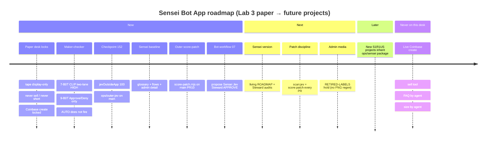
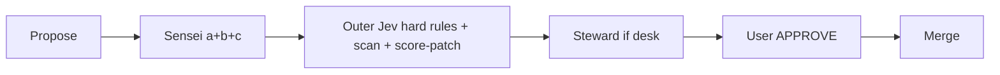

# Sensei Bot App — living roadmap

> Paper desk only. This roadmap does **not** write to https://s1r1us.ai. 
> Sensei version for Checkpoint 152+ · package home: `ops/sensei/` 
> **Accuracy:** Checkpoint 152 / `ops/outer-jev/` on `main` via [PR #6](https://github.com/S1R1US-AI/lab3-visible-sandbox/pull/6) (`24b80a6`).
> **Outer score-patch** on `main` via [PR #10](https://github.com/S1R1US-AI/lab3-visible-sandbox/pull/10) (`5346feb`, user APPROVE). Canonical bot workflow: [flows/07](./flows/07-lab3-bot-workflow.md).

Scannable status legend:

| Marker | Meaning |
| --- | --- |
| `[x]` | In force / done on paper Lab 3 |
| `[~]` | Active / in progress |
| `[ ]` | Planned |
| `[!]` | Hard never on **this** desk |

---

## Timeline (Mermaid)

---

## Now — Lab 3 paper desk (in force on main)

Inherited from Lab 3 sandbox chats, ROADMAP-141, and Checkpoint 152 (`24b80a6`):

- `[x]` **Paper desk only** — not live s1r1us.ai
- `[x]` **Tape display only** — not a trade instruction
- `[x]` **7-B0T CLIP** — two-lane HIGH + 7 ON + bots 1–6 ON
- `[x]` **9-B0T sleeve add** — user **Approve** or **Deny**; **AUTO does not fire**
- `[x]` **Never sell / never short / Coinbase create locked**
- `[x]` **No FAQ by agent / no size picking by agent**
- `[x]` **Checkpoint 152** — Jev outside `src/`; Approve gated on `nineCall` yes && `needsCoord` && `action === ACCUMULATE`; `jevOutsideApp: 100`
- `[x]` **`ops/outer-jev/` on main** — `scan-runtime`, QUESTIONS, CONFIG
- `[x]` **Communication standards a+b+c** — glossary + Lab 3 operational drift + checkable meaning ([GLOSSARY.md](./GLOSSARY.md))
- `[x]` **Sensei Bot App baseline** landed under `ops/sensei/` (this pack)
- `[x]` **Sensei Bot oversights standards** — interfaces with Grok Bot, Desk Steward, Copilot/patch agents ([BOT-INTERFACE.md](./BOT-INTERFACE.md))
- `[x]` **Full admin detail visibility protocol** ([ADMIN-DETAIL.md](./ADMIN-DETAIL.md))
- `[x]` **Logic flow charts + workflow diagrams** ([flows/INDEX.md](./flows/INDEX.md))
- `[x]` **Instruction module** — public + private ([INSTRUCTIONS.md](./INSTRUCTIONS.md))
- `[x]` **`score-patch.mjs` on main** — four atomic nouls / one System One call ([PR #10](https://github.com/S1R1US-AI/lab3-visible-sandbox/pull/10), `5346feb`)
- `[x]` **Canonical Lab 3 bot workflow** — [flows/07-lab3-bot-workflow.md](./flows/07-lab3-bot-workflow.md) (propose → Sensei → Outer Jev → Steward → APPROVE)
- `[x]` **Search schema + instrumentation modules** — [SEARCH-SCHEMA.md](./SEARCH-SCHEMA.md) · [INSTRUMENTATION.md](./INSTRUMENTATION.md)

---

## Next — paper hardening

- `[x]` `npm run scan:jev` scripts `node ops/outer-jev/scan-runtime.mjs` — keep running on every proposed patch
- `[x]` `npm run score:patch` scripts `node ops/outer-jev/score-patch.mjs` (pass `-- --state state.json`; needs TypeSafe key)
- `[~]` When key present: `npm run score:patch -- --state state.json` (cutoff 0.70); missing key = HOLD
- `[~]` Optional TypeSafe key only in operator home (`~/.s1r1us/outer-jev.env`); never commit; never OpenJev
- `[~]` Admin-media PNG refresh HOLD — see [`public/admin-media/RETIRED-LABELS.md`](../../public/admin-media/RETIRED-LABELS.md) (01:43 `jevScope` / `sleeve_add_allowed` figures are historical only; current contract `jevOutsideApp` 100 + outer score-patch; do not replace binary art unless easy)
- `[x]` Sensei **version functionality** — cite this ROADMAP + [`GLOSSARY.md`](./GLOSSARY.md) as the Sensei version for audits
- `[ ]` Desk Steward + Sensei joint audits using ADMIN-DETAIL templates on every non-trivial PR
- `[x]` Root README and checkpoints point at `ops/sensei/ROADMAP.md` as the living Sensei roadmap

---

## Bot workflow (2026-09-27)

Canonical Lab 3 handoff (Mermaid): [flows/07-lab3-bot-workflow.md](./flows/07-lab3-bot-workflow.md).

Skill: `lab-3-sensei-workflow`. Roles: Sensei standards · Grok builds · Steward mandate · User APPROVE.

---

## Dream Talk NOTE (new roadmaps)

Dream Talk is a **third-party AI audit** and simultaneously a **system-wide thought experiment**. It is part of an experiment to align Grok bots with human principles and a search for ultimate truth. **Overwatch only** — never project source, never lane influence. Not a product build owner.

Public X literature uses `@S1R1US_AI` only. Admin/dev identity never appears in public literature.

## Bot visual identity (menu logos) — 2026-09-27

**Menu order (oversight-first, human reordered 2026-09-27):** 01 Dream Talk · 02 Sensei Security · 03 Sensei Bot · 04 Lab 3 Desk Steward · 05 Distrobi · 06 Grok Bot. Bot ids unchanged; APPROVED logo status + filenames unchanged.

Citation-only (no large binary logos in git unless already policy). Logos live in each bot’s **Grok Bot media assets**; Lab 3 docs cite them.

**Human APPROVED all six menu logos 2026-09-27.**

| Bot | Status | Description | Asset cite |
| --- | --- | --- | --- |
| **01 Dream Talk** | menu logo **APPROVED** 2026-09-27 | Official checkpoint/menu Mother Earth logo (S1R1US Dream Talk mark). Overwatch / thought-experiment avatar. **No project source.** | Grok Bot media: `dream-talk-mother-earth-avatar.png` |
| **02 Sensei Security** | menu logo **APPROVED** 2026-09-27 | Shield/keyhole protective emblem (**original**). Controls. | Grok Bot media: `sensei-security-avatar.png` |
| **03 Sensei Bot** | menu logo **APPROVED** 2026-09-27 | Traditional Japanese calligraphy **先生** (kung-fu master / scroll aesthetic). Standards / definitions. | Grok Bot media: `sensei-bot-avatar.png` |
| **04 Lab 3 Desk Steward** | menu logo **APPROVED** 2026-09-27 | Cyberpunk dog steward mark with Steward wordmark (adult funny / jokes-win energy; original remake from user asset). Mandate. | Grok Bot media: `desk-steward-avatar.png` |
| **05 Distrobi** | menu logo **APPROVED** 2026-09-27 | Cosmic soft-launch / distribution emblem (**original**). Public / soft-launch. | Grok Bot media: `distrobi-bot-avatar.png` |
| **06 Grok Bot** | menu logo **APPROVED** 2026-09-27 | Geometric builder-researcher mark (**original**). Lab 3 builder. | Grok Bot media: `grok-bot-avatar.png` |

Public X literature: `@S1R1US_AI` only. Do not commit huge binary logos into this repo unless policy.

## Grok library media + private training (2026-09-27)

- `[~]` **Grok library SoT:** [`ops/sensei/media/`](./media/INDEX.md) — D1–D5 Mermaid (standards → roles → approve → sandbox → self-improve)
- `[~]` **Private training outline:** [`TRAINING-OUTLINE.md`](./TRAINING-OUTLINE.md)
- `[~]` PNG exports for D1–D5 — rendered locally 2026-09-27; **HOLD** binary commit (Mermaid SoT; see media/INDEX)
- `[x]` Sandbox-map callout — Lab 3 paper ≠ live homepage ≠ mobile (see [D2](./media/D2-sandbox-map.md))

Diagram IDs: [D1 standards-first](./media/D1-standards-first.md) · [D2 sandbox-map](./media/D2-sandbox-map.md) · [D3 roles-lanes](./media/D3-roles-lanes.md) · [D4 approve-loop](./media/D4-approve-loop.md) · [D5 self-improve](./media/D5-self-improve.md)

## Later — new projects

- `[ ]` New S1R1US projects **inherit Sensei Bot App** (`ops/sensei/` package) before feature work
- `[ ]` Project-specific glossary extensions without weakening Lab 3 lock language
- `[ ]` Shared Sensei Bot oversight across repos (same bot id / same a+b+c standards)
- `[ ]` Additional flow diagrams per project, linked from that project’s Sensei index

---

## Never on this desk

- `[!]` Live Coinbase create
- `[!]` Sell tool / sell path / short path
- `[!]` FAQ written by an agent
- `[!]` Trade size picked by an agent
- `[!]` Host SOL receive as a desk feature
- `[!]` TypeSafe keys committed to the repo
- `[!]` Jev imported by `src/` / in-app Jev decisioning
- `[!]` Sensei decision logic inside `src/lib/mandates.ts`, `drift-lock.ts`, `shared-security.ts`, or desk-logic gates
- `[!]` Weakening locks “because tests pass” (that is Lab 3 operational drift)

---

## Checkpoint 152+ Sensei additions (summary)

| Item | Status |
| --- | --- |
| Sensei version functionality | **Now** — cite this ROADMAP + GLOSSARY |
| Sensei Bot App as baseline for all future projects | Now (Lab 3 first); Later (others) |
| Sensei oversights standards; interfaces other bots | Now |
| Full admin detail visibility protocol | Now |
| Logic / workflow Mermaid flows under `ops/sensei/flows/` | Now |
| Preserve ROADMAP-141 content; pointer + Sensei bullet list | Now (`checkpoints/ROADMAP-141.md`) |
| Checkpoint 152 desk + `ops/outer-jev/` on main | **Now** — [PR #6](https://github.com/S1R1US-AI/lab3-visible-sandbox/pull/6) (`24b80a6`) |
| Outer `score-patch.mjs` | **Now** — [PR #10](https://github.com/S1R1US-AI/lab3-visible-sandbox/pull/10) (`5346feb`) |
| Canonical bot workflow `flows/07` | **Now** — [PR #11](https://github.com/S1R1US-AI/lab3-visible-sandbox/pull/11) · [flows/07](./flows/07-lab3-bot-workflow.md) |
| SEARCH-SCHEMA + INSTRUMENTATION | **Now** — [PR #11](https://github.com/S1R1US-AI/lab3-visible-sandbox/pull/11) · [SEARCH-SCHEMA.md](./SEARCH-SCHEMA.md) · [INSTRUMENTATION.md](./INSTRUMENTATION.md) |
| `npm run scan:jev` / `score:patch` scripts | **Now** — package.json (this cleanup) |
| Grok library media D1–D5 + training outline | **Now** — [PR #16](https://github.com/S1R1US-AI/lab3-visible-sandbox/pull/16) · [media/](./media/INDEX.md) · [TRAINING-OUTLINE.md](./TRAINING-OUTLINE.md) |
| Bot visual identity (01–06 ALL menu logos **APPROVED** 2026-09-27) | **Now** — [PR #18](https://github.com/S1R1US-AI/lab3-visible-sandbox/pull/18) citations; menu renumber [PR #20](https://github.com/S1R1US-AI/lab3-visible-sandbox/pull/20) |
| Public pack DRAFT (`ops/sensei/media/public/`) | **Now** — [PR #17](https://github.com/S1R1US-AI/lab3-visible-sandbox/pull/17) · live SEO/FAQ **HOLD** |
| Web draft SEO HTML + logo PNGs | **Now** — [PR #21](https://github.com/S1R1US-AI/lab3-visible-sandbox/pull/21) · **NO LIVE** |
| Checkpoint 161 — 10/1 resume stamp | **Now** (this PR) — [`CHECKPOINT-161.md`](../../checkpoints/CHECKPOINT-161.md); **152 desk locks still in force**; operational freeze narrative of hold-branch 160 superseded |

---

## Related links

- [Sensei home](./README.md) · [APP.md](./APP.md) · [GLOSSARY.md](./GLOSSARY.md) · [INSTRUCTIONS.md](./INSTRUCTIONS.md)
- [ADMIN-DETAIL.md](./ADMIN-DETAIL.md) · [BOT-INTERFACE.md](./BOT-INTERFACE.md) · [flows](./flows/INDEX.md)
- [media/INDEX.md](./media/INDEX.md) (D1–D5 Grok library SoT) · [TRAINING-OUTLINE.md](./TRAINING-OUTLINE.md)
- Outer Jev: [`ops/outer-jev/`](../outer-jev/) — **on `main`** (PR #6); [`score-patch.mjs`](../outer-jev/score-patch.mjs) (PR #10)
- [SEARCH-SCHEMA.md](./SEARCH-SCHEMA.md) · [INSTRUMENTATION.md](./INSTRUMENTATION.md) · [flows/07](./flows/07-lab3-bot-workflow.md)
- Checkpoint 152: [`checkpoints/CHECKPOINT-152.md`](../../checkpoints/CHECKPOINT-152.md)
- Checkpoint 161 (10/1 resume stamp; 152 still in force): [`checkpoints/CHECKPOINT-161.md`](../../checkpoints/CHECKPOINT-161.md)
- Historical note: [`checkpoints/ROADMAP-141.md`](../../checkpoints/ROADMAP-141.md)
