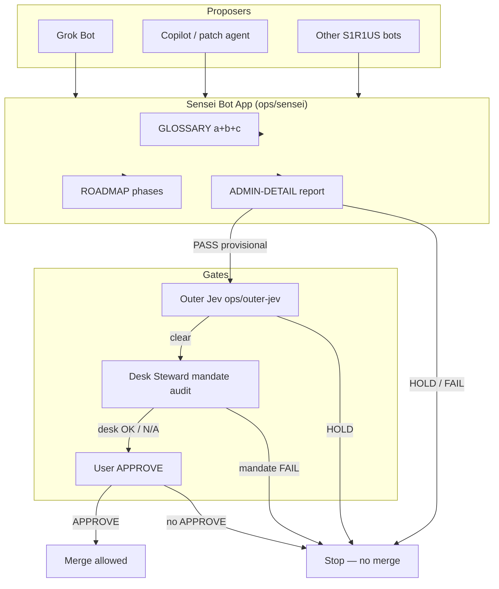

# 01 — Sensei oversight of other bots

Sensei Bot oversees standards adherence across S1R1US bots. It does not replace Desk Steward mandate inventory or user APPROVE.

**Notes**

- Sensei id: `d40cd9e7-579d-4fc6-b860-60143c9d0b42`
- Paper Lab 3 only until a new project inherits the package
- See [BOT-INTERFACE.md](../BOT-INTERFACE.md)
