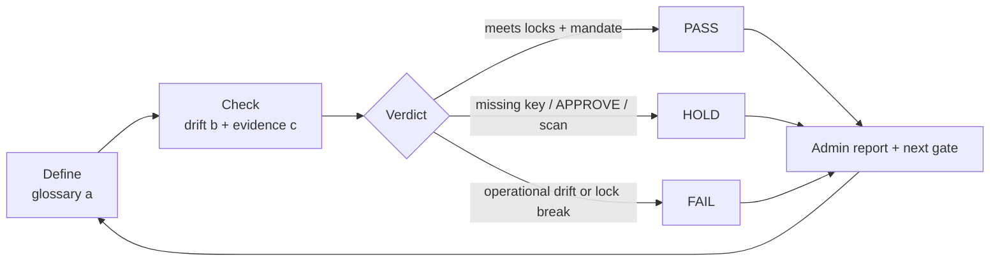
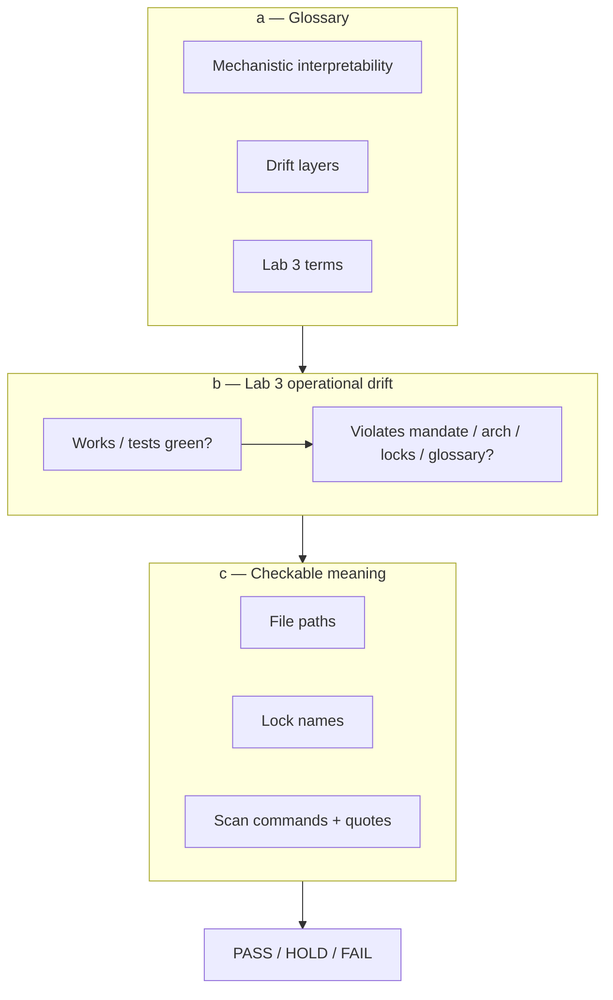

# 02 — Standards adherence loop

Definition → check → verdict. Communication standards **a + b + c**.

```mermaid
flowchart LR
  D[Define<br/>glossary a] --> C[Check<br/>drift b + evidence c]
  C --> V{Verdict}
  V -->|meets locks + mandate| P[PASS]
  V -->|missing key / APPROVE / scan| H[HOLD]
  V -->|operational drift or lock break| F[FAIL]

  P --> R[Admin report + next gate]
  H --> R
  F --> R
  R --> D
```

```mermaid
flowchart TB
  subgraph a["a — Glossary"]
    T1[Mechanistic interpretability]
    T2[Drift layers]
    T3[Lab 3 terms]
  end
  subgraph b["b — Lab 3 operational drift"]
    Q1[Works / tests green?]
    Q2[Violates mandate / arch / locks / glossary?]
    Q1 --> Q2
  end
  subgraph c["c — Checkable meaning"]
    E1[File paths]
    E2[Lock names]
    E3[Scan commands + quotes]
  end
  a --> b --> c --> OUT[PASS / HOLD / FAIL]
```

**Rule:** Green tests + lock violation = **FAIL** (operational drift), not PASS.
