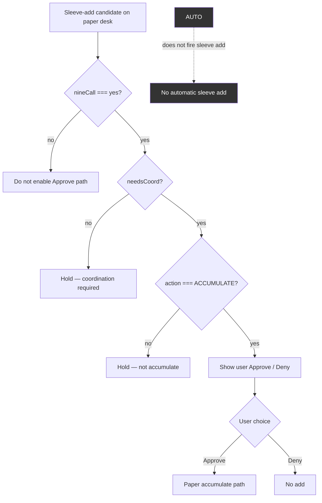

# 03 — Lab 3 maker-checker (nineCall + Approve/Deny)

In-app sleeve adds are **maker-checker**. There is **no in-app Jev**. AUTO does not fire sleeve add.

**Checkpoint 152 (preserve full desk)** — pending [PR #6](https://github.com/S1R1US-AI/lab3-visible-sandbox/pull/6) on `main`

- Approve gated on: `nineCall` yes **&&** `needsCoord` **&&** `action === ACCUMULATE`
- `jevOutsideApp: 100` — Jev not inside the app
- 7-B0T CLIP still requires two-lane HIGH + 7 ON + bots 1–6 ON (desk condition; cited here, not reimplemented in Sensei)

**Legacy art:** [`S1R1US-bot-functions-flowchart.png`](../../../public/admin-media/S1R1US-bot-functions-flowchart.png)
