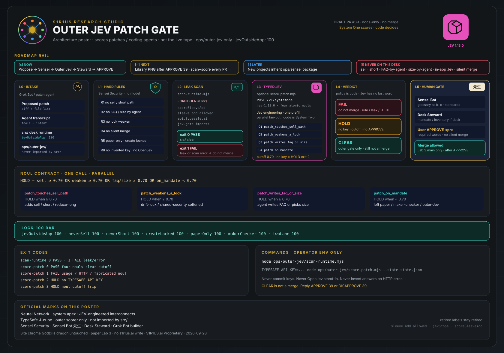
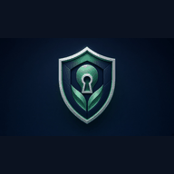
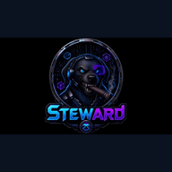
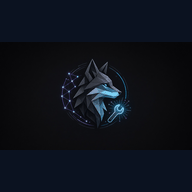
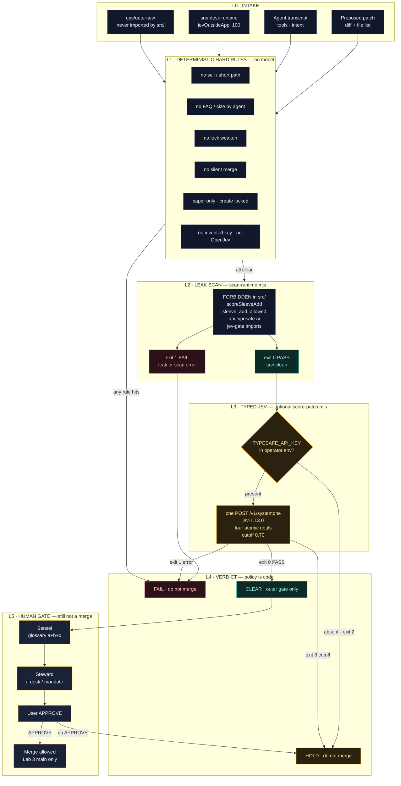
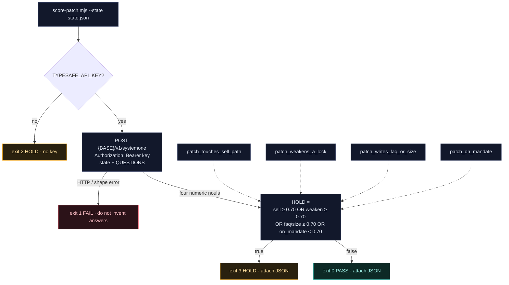

# 04 — Outer Jev patch gate

Jev scores **patches / coding agents**, not the live tape. Lives only under `ops/outer-jev/`. Hard rules run **before** any model. Optional scorer: `score-patch.mjs`. No OpenJev. Not imported by `src/`.

Canonical handoff sequence stays in [07-lab3-bot-workflow](./07-lab3-bot-workflow.md). This file is the architecture.

---

## Studio poster — official marks + roadmap rail

GitHub-renderable control-plane poster. Uses the **APPROVED Neural Network** system mark (hub · rainbow · JEV interconnects), the official TypeSafe J-cube for the outer scorer, official bot marks for Sensei / Steward / Grok, and the Sensei [ROADMAP](../ROADMAP.md) Now / Next / Later / Never rail.



Official logo strip (already APPROVED 2026-09-27 — cited, not re-authored):

<p>







</p>

| Mark | Role on this gate |
| --- | --- |
| **Neural Network** | System apex. Oversight / recursive engineer. Not a live-tape voter. |
| **TypeSafe J-cube** | Outer scorer only (`jev-1.13.0` / System One). Code is System Two. |
| **Sensei Security** | L1 deterministic hard rules. No model. |
| **Sensei Bot 先生** | L5 glossary a+b+c. Standards, not merge. |
| **Desk Steward** | L5 mandate / inventory if the patch touches the desk. |
| **Grok Bot** | L0 proposer / builder. Does not self-merge. |
| **7-B0T / 9-B0T** | Desk context only. Gate still never sells, never sizes, never writes FAQ. |

Library PNG target (HOLD until **APPROVE 39**):

- [`public/admin-media/S1R1US-outer-jev-patch-gate.png`](../../../public/admin-media/S1R1US-outer-jev-patch-gate.png)

Jev engineering reference (official X, not a product import): System One is a parallel decision primitive — state + typed questions in, nouls out, code branches. Do not plug Jev into high-level product decisions inside `src/`. Program the gate.

---

## Control plane

Six planes. Fail-closed. Policy is code — Jev never has the last word.



---

## Execution — four nouls, one call



| Noul | HOLD when | Means |
| --- | --- | --- |
| `patch_touches_sell_path` | ≥ 0.70 | Patch adds or opens a sell / short / reduce-long path |
| `patch_weakens_a_lock` | ≥ 0.70 | drift-lock or shared-security lock is softened |
| `patch_writes_faq_or_size` | ≥ 0.70 | Agent writes FAQ copy or picks a trade size |
| `patch_on_mandate` | **< 0.70** | Patch left paper accumulate / maker-checker / outer-Jev mandate |

Cutoff `0.70` is code in `ops/outer-jev/score-patch.mjs`. Jev returns nouls. Code decides.

---

## Exit codes

| Tool | Exit | Meaning |
| --- | --- | --- |
| `scan-runtime.mjs` | 0 | PASS — no in-app Jev in `src/` |
| `scan-runtime.mjs` | 1 | FAIL — leak or scan error |
| `score-patch.mjs` | 0 | PASS — four nouls clear cutoff |
| `score-patch.mjs` | 1 | Error — usage / HTTP / fabricated noul |
| `score-patch.mjs` | 2 | HOLD — no `TYPESAFE_API_KEY` |
| `score-patch.mjs` | 3 | HOLD — noul cutoff trip |

---

## Hard rules (always, before any model)

- Never add a sell tool
- Never write FAQ from an agent
- Never pick a trade size
- Never weaken drift-lock / shared-security locks
- Never merge to main without user **APPROVE**
- Never sell, never short, Coinbase create locked, paper only
- Never invent keys; never OpenJev stand-in

## Commands

```bash
node ops/outer-jev/scan-runtime.mjs

# optional — operator env only; never commit
TYPESAFE_API_KEY=... node ops/outer-jev/score-patch.mjs --state state.json

# optional gateway (same System One shape):
# TYPESAFE_BASE_URL=https://openrouter.ai/api TYPESAFE_API_KEY=$OPENROUTER_API_KEY \
#   node ops/outer-jev/score-patch.mjs --state state.json
```

Key location: operator env only — never commit. See `ops/outer-jev/CONFIG.md`, `QUESTIONS.md`, and [INSTRUMENTATION.md](../INSTRUMENTATION.md).

Retired in-app labels (do not restore): `sleeve_add_allowed`, `jevScope`, `scoreSleeveAdd`, desk Jev panel.
