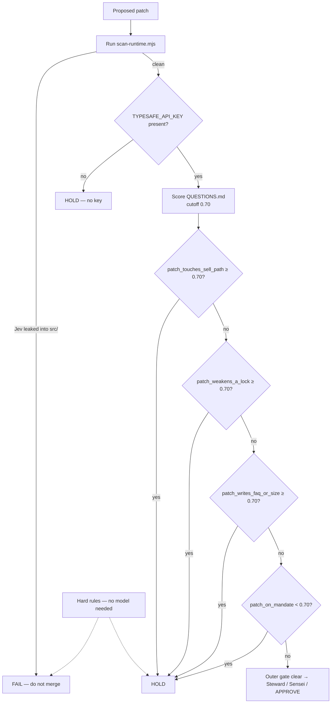

# 04 — Outer Jev patch gate

Jev scores **patches / coding agents**, not the live tape. Lives only under `ops/outer-jev/`.



**Hard rules (always)**

- Never add a sell tool
- Never write FAQ from an agent
- Never pick a trade size
- Never weaken drift-lock / shared-security locks
- Never merge to main without user **APPROVE**
- Never sell, never short, Coinbase create locked, paper only

**Commands**

```bash
node ops/outer-jev/scan-runtime.mjs
```

Key location: operator env only — never commit. See `ops/outer-jev/CONFIG.md` and `QUESTIONS.md`.
