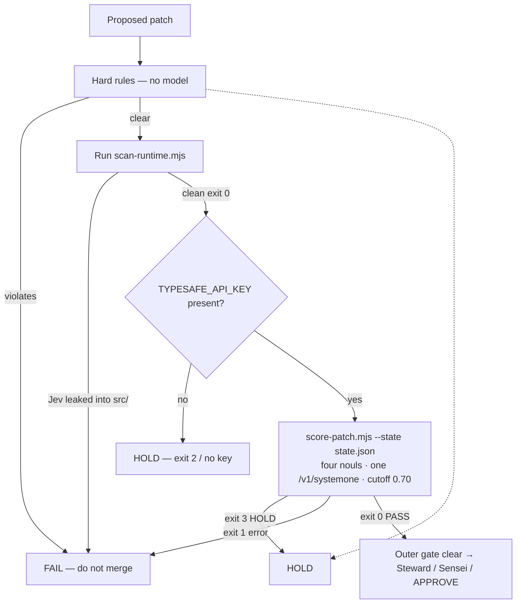

# 04 — Outer Jev patch gate

Jev scores **patches / coding agents**, not the live tape. Lives only under `ops/outer-jev/`. Hard rules run **before** any model. Optional scorer: `score-patch.mjs` (PR #10, `5346feb`). No OpenJev.



**Hard rules (always)**

- Never add a sell tool
- Never write FAQ from an agent
- Never pick a trade size
- Never weaken drift-lock / shared-security locks
- Never merge to main without user **APPROVE**
- Never sell, never short, Coinbase create locked, paper only
- Never invent keys; never OpenJev stand-in

**Commands**

```bash
node ops/outer-jev/scan-runtime.mjs

# optional — operator env only; never commit
TYPESAFE_API_KEY=... node ops/outer-jev/score-patch.mjs --state state.json

# optional gateway (same System One shape):
# TYPESAFE_BASE_URL=https://openrouter.ai/api TYPESAFE_API_KEY=$OPENROUTER_API_KEY \
#   node ops/outer-jev/score-patch.mjs --state state.json
```

Key location: operator env only — never commit. See `ops/outer-jev/CONFIG.md`, `QUESTIONS.md`, and [INSTRUMENTATION.md](../INSTRUMENTATION.md). Canonical handoff: [07-lab3-bot-workflow](./07-lab3-bot-workflow.md).
