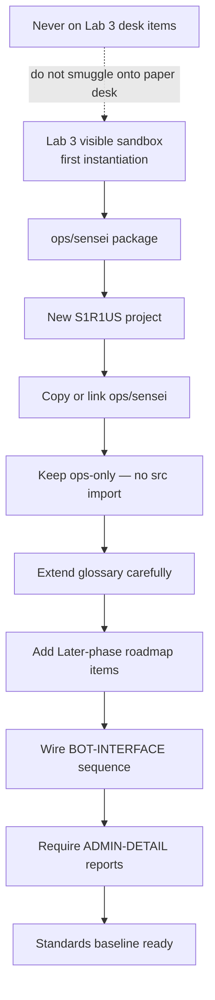
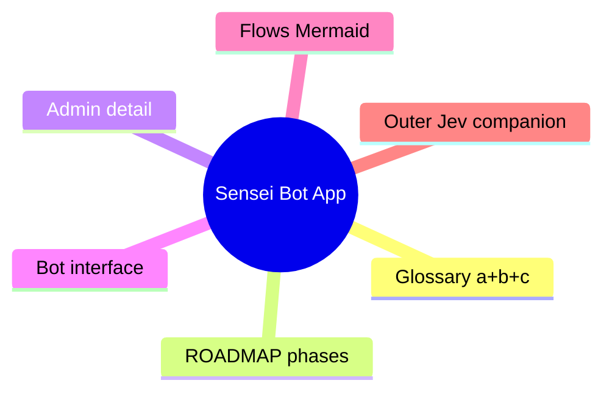

# 05 — Sensei Bot App as baseline for new projects

Lab 3 is the first instantiation. Future S1R1US projects inherit the `ops/sensei/` package before feature work.

See [APP.md](../APP.md) and [ROADMAP.md](../ROADMAP.md) § Later.
