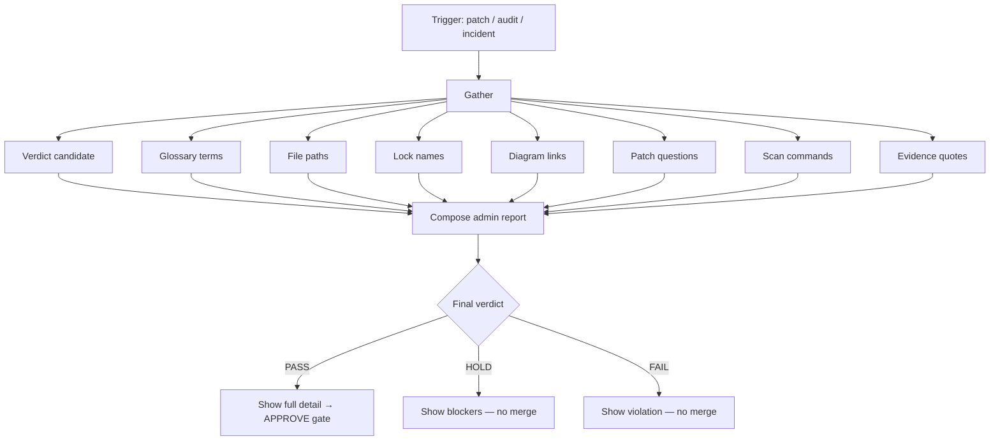

# 06 — Admin detail disclosure flow

Max-detail reports for Sensei and peer bots. Templates live in [ADMIN-DETAIL.md](../ADMIN-DETAIL.md).

**Minimum bar:** verdict + glossary cite + path + evidence quote. Prefer including scan command output when a patch is involved.
