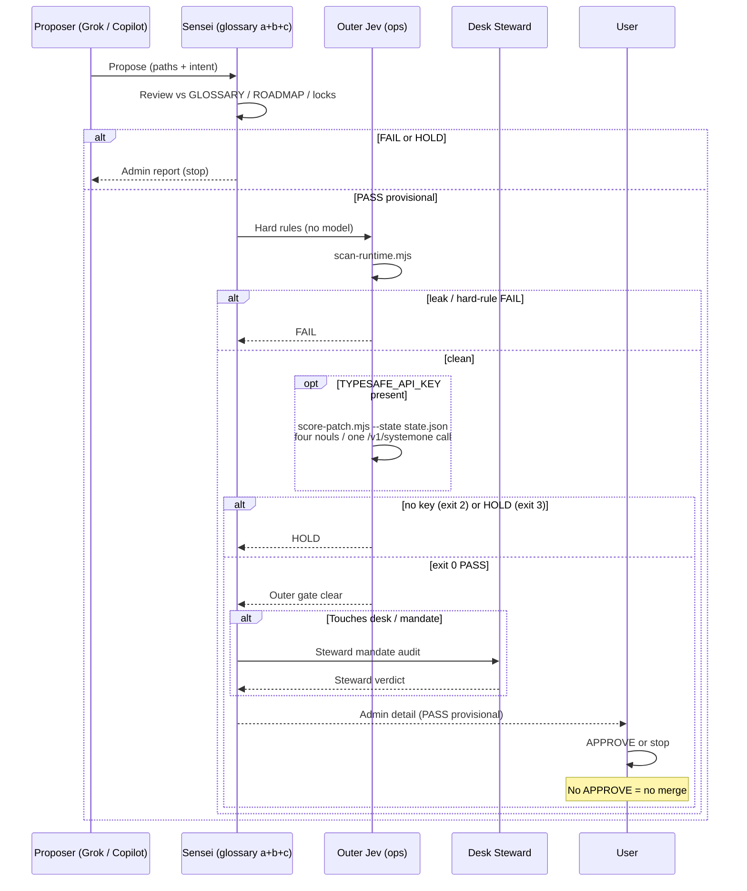
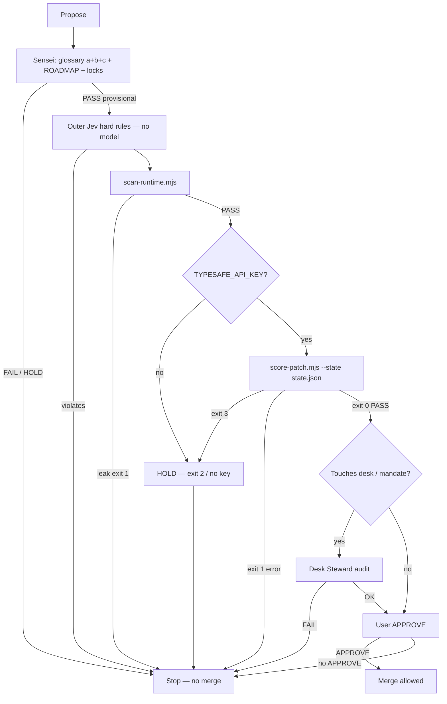

# 07 — Lab 3 bot workflow (canonical)

Primary handoff for Lab 3 paper desk patches. Cite [GLOSSARY.md](../GLOSSARY.md) (a+b+c), [BOT-INTERFACE.md](../BOT-INTERFACE.md), and [`ops/outer-jev/`](../../outer-jev/). Skill: **lab-3-sensei-workflow**. No OpenJev. No merge without user **APPROVE**.

## Sequence



## Flowchart



## Cite

| Step | Artifact |
| --- | --- |
| Standards | [GLOSSARY.md](../GLOSSARY.md) · [ROADMAP.md](../ROADMAP.md) |
| Handoff | [BOT-INTERFACE.md](../BOT-INTERFACE.md) · skill `lab-3-sensei-workflow` |
| Outer Jev | [04-outer-jev-patch-gate](./04-outer-jev-patch-gate.md) · [`scan-runtime.mjs`](../../outer-jev/scan-runtime.mjs) · [`score-patch.mjs`](../../outer-jev/score-patch.mjs) (PR #10, `5346feb`) · [QUESTIONS.md](../../outer-jev/QUESTIONS.md) · [CONFIG.md](../../outer-jev/CONFIG.md) |
| Reports / exits | [ADMIN-DETAIL.md](../ADMIN-DETAIL.md) · [INSTRUMENTATION.md](../INSTRUMENTATION.md) |
| Search terms | [SEARCH-SCHEMA.md](../SEARCH-SCHEMA.md) |

**Commands**

```bash
node ops/outer-jev/scan-runtime.mjs
# optional key in operator env only — never commit; never invent; never OpenJev
TYPESAFE_API_KEY=... node ops/outer-jev/score-patch.mjs --state state.json
# optional gateway:
# TYPESAFE_BASE_URL=https://openrouter.ai/api TYPESAFE_API_KEY=$OPENROUTER_API_KEY ...
```
