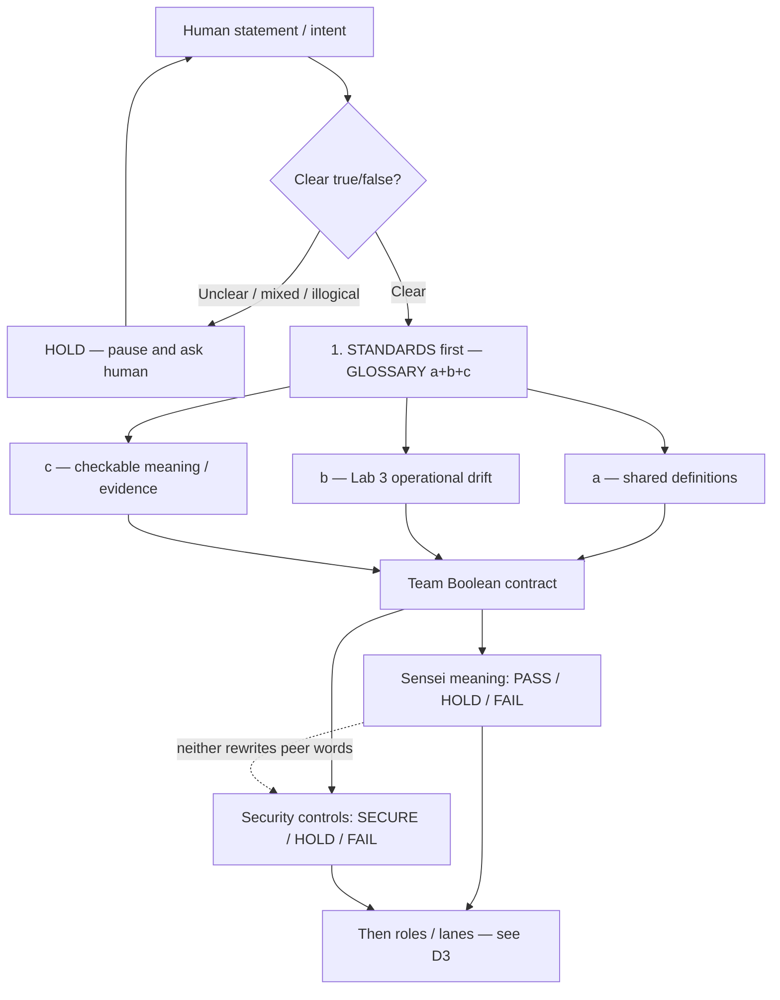

# D1 — Standards-first (GLOSSARY a+b+c + Team Boolean)

**SoT:** `ops/sensei/media/` · **Cite:** [GLOSSARY.md](../GLOSSARY.md) (a+b+c + Team Boolean)  
**Story:** Lock shared definitions **before** roles/lanes. Dual verdict vocabularies must not rewrite each other. HOLD ≠ FAIL.

## Flow

## Notes

- Sensei owns **PASS/HOLD/FAIL** (mission meaning).
- Security Sensei owns **SECURE/HOLD/FAIL** (controls).
- HOLD means unknown / ask — not denied (FAIL).
- No contested geopolitics in glossary as asserted truth.
