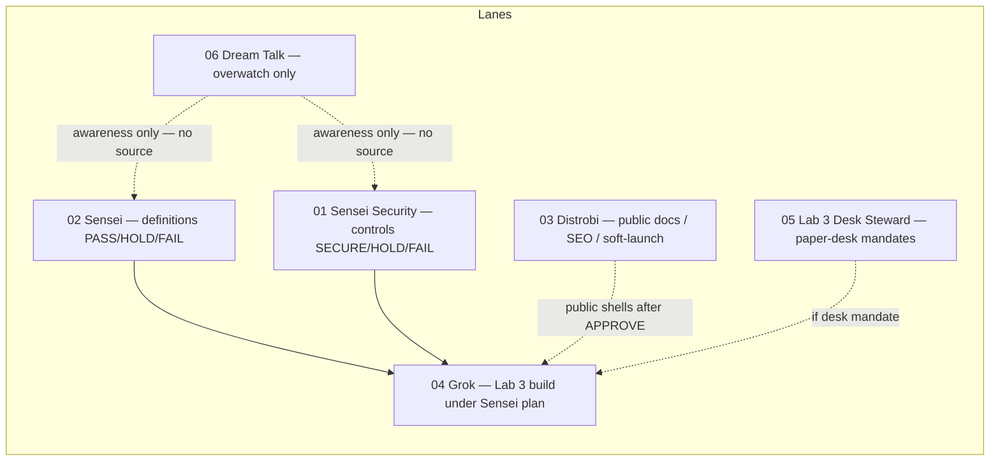

# D3 — Roles / lanes

**SoT:** `ops/sensei/media/` · Standards (D1) come **before** this diagram.  
**Dream Talk:** overwatch only — never project source, never lane rewrite.

## Flow

## Notes

| Lane | Owns | Does not |
| --- | --- | --- |
| 01 Security | Controls verdict vocabulary | Meaning PASS words |
| 02 Sensei | Glossary / ROADMAP meaning | Security SECURE words; silent merge |
| 03 Distrobi | Public / SEO / websites shell | Lab 3 private mechanics leak |
| 04 Grok | Lab 3 private build + media library deposit | Merge without human APPROVE |
| 05 Steward | Paper-desk mandate audit | Substitute for user APPROVE |
| 06 Dream Talk | Third-party AI audit + system-wide thought experiment | Project source; lane influence |
