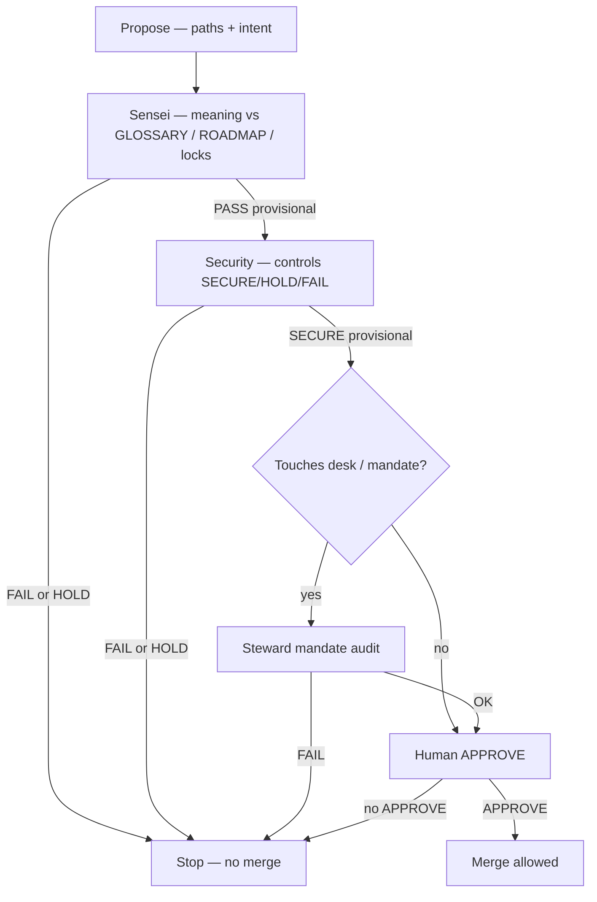

# D4 — Approve loop

**SoT:** `ops/sensei/media/` · No silent merge. Human **APPROVE** before main.  
**Aligns with:** [flows/07-lab3-bot-workflow.md](../flows/07-lab3-bot-workflow.md)

## Flow

## Notes

- Sensei never substitutes for human APPROVE.
- Steward never substitutes for human APPROVE.
- Outer Jev scan (`npm run scan:jev`) sits with Security/ops gates on patches — see flows/04 and flows/07.
- Public X literature: `@S1R1US_AI` only.
