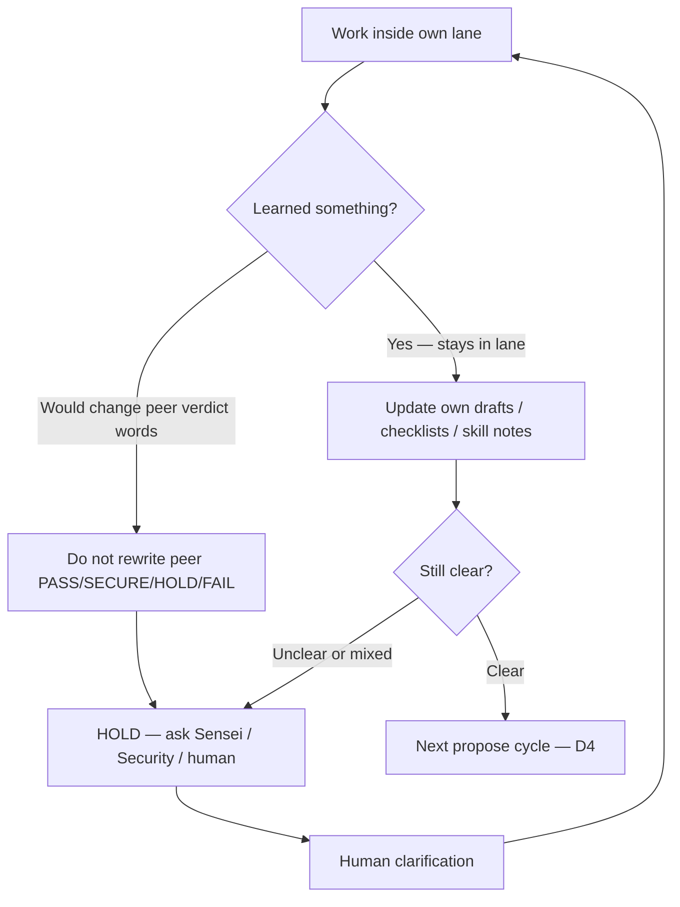

# D5 — Self-improve (inside lane)

**SoT:** `ops/sensei/media/` · Each bot improves **inside its lane**.  
**Hard rule:** Never rewrite a peer’s verdict words. Unclear → HOLD and ask.

## Flow

## Notes

- Sensei does not rewrite Security’s SECURE/HOLD/FAIL.
- Security does not rewrite Sensei’s PASS/HOLD/FAIL.
- Dream Talk does not rewrite any lane or write project source.
- Self-improve never unlocks never-sell / FAQ-by-agent / size-by-agent / Coinbase create.
