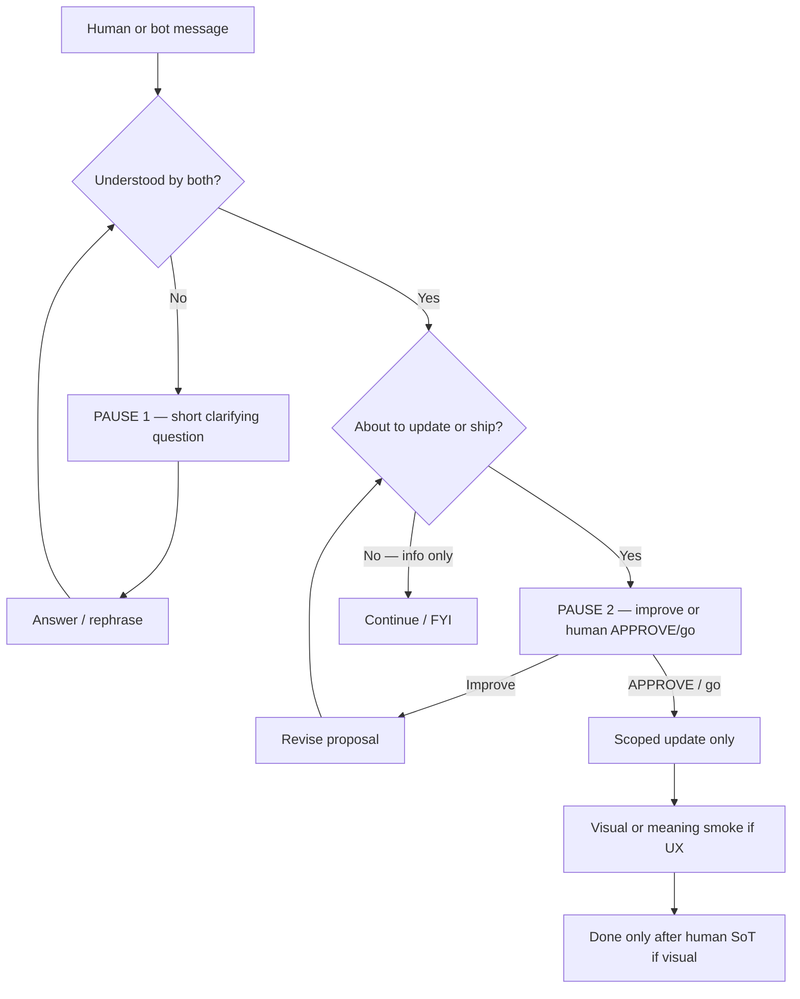

# D6 — Two-way communication (main theme)

**SoT:** `ops/sensei/media/` · Human ↔ bot communication is a **main training theme**, equal priority with standards and approve.  
**Stamp:** 2026-09-28 · evidence: soft-launch drift / matrix-mistake / theme-css-miss  
**Rule:** Both human and bot must clarify when not understanding. Consistent two-way communication is recognized by **human and bot** as priority.

## Three pause gates (locked)

1. **Clarify meaning** — If intent/theme/UX/words are unclear → **pause** → one **short question** → wait for answer → then go.
2. **Prior to updates** — Before live wire, theme ship, or material doc/code update → **pause** for improve-or-APPROVE (human go / APPROVE). Do not assume and ship.
3. **Ongoing two-way priority** — Human and bots treat back-and-forth clarity as first-class, not optional chatter.

## Flow

## Notes

- HOLD ≠ FAIL — pause-to-clarify is success behavior.
- Bot READY/SECURE does not replace human visual SoT or human go.
- Soft-launch example: should have paused before wiring more rain/theme pages.
- Related: [DRIFT-BOT-HUMAN-COMMS-2026-09-28.md](../DRIFT-BOT-HUMAN-COMMS-2026-09-28.md) · [DRIFT-EXTENDED-HUMAN-EVIDENCE-2026-09-28.md](../DRIFT-EXTENDED-HUMAN-EVIDENCE-2026-09-28.md) · GLOSSARY Team Boolean.
