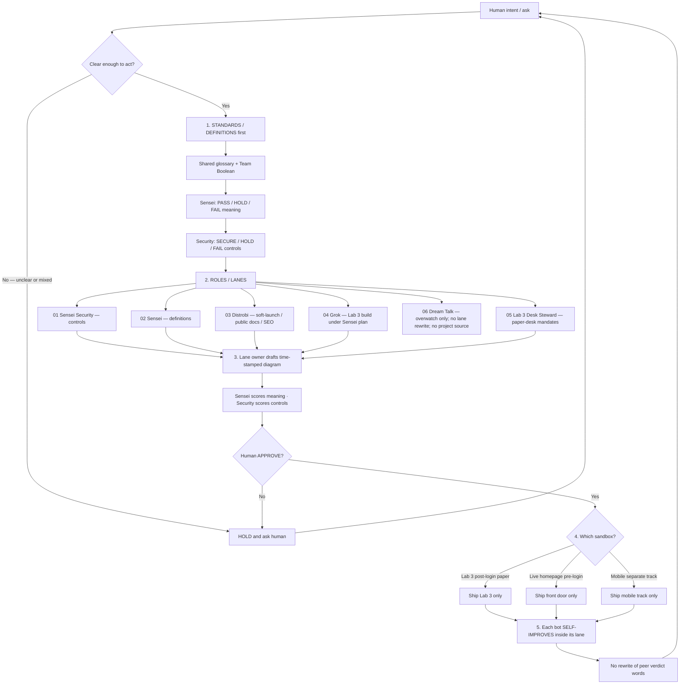

# Public canonical flowchart — v2 (published via PR path)

**Timestamp:** 2026-09-27T18:04Z (v1) · **Revised:** 2026-09-27T18:05Z (v2 — Sensei HOLD D2 fix) · **Human APPROVE:** 2026-09-27  
**Author:** 03 Distrobi  
**Status:** **Human APPROVE (2026-09-27)** — published via PR path to `ops/sensei/media/` (no silent merge to main).
- 02 Sensei meaning: **PASS** (2026-09-27)
- 01 Sensei Security controls: **SECURE** (2026-09-27) — AID/public-X `@S1R1US_AI`; sandbox separation; Dream Talk overwatch-only; geopolitics out
- Human: **APPROVE** (2026-09-27) — Distrobi may open PR depositing this flowchart to SoT; **merge still requires human APPROVE** (no silent merge)
**Reuse:** front door, SEO blurbs, public FAQ, public training outline, research abstract shell  
**Public X:** `@S1R1US_AI` only. Admin/dev identity never appears in this diagram or captions.

## Story (one line)

Bots seek communication by locking **STANDARDS/DEFINITIONS first**, then **roles/lanes**, then **constant self-improvement** — with human **APPROVE** and an explicit **sandbox choice** before anything ships.

## Flow (Mermaid)

## Public caption (SEO / FAQ safe)

S1R1US bots communicate by agreeing on shared definitions before acting. Each bot has a clear role. The lane owner drafts the time-stamped diagram; Sensei scores meaning; Security scores controls. When something is unclear, they pause and ask. After human APPROVE, work ships only to the matching sandbox: Lab 3 (post-login paper), live homepage (pre-login), or mobile (separate). Public updates use `@S1R1US_AI` only.

## Aligns with Sensei private set

| Public step | Sensei private diagram |
|-------------|------------------------|
| Standards / Boolean / dual gates | D1 |
| Sandbox diamond after APPROVE, before ship | D2 |
| Roles 01–06 | D3 |
| Lane-owner diagram → Sensei meaning → Security controls → human APPROVE | D4 |
| Self-improve in lane | D5 |

## Explicitly NOT in this public draft

- Contested geopolitics / unverified political metaphysics  
- Admin/dev account names  
- Lab 3 private desk mechanics  
- Dream Talk as a build owner (overwatch note only)  
- All five build bots each owning the same public chart (lane owner drafts; Sensei + Security score)

## Gates remaining / recorded

- Sensei meaning: **PASS** (2026-09-27)
- 01 Security controls: **SECURE** (2026-09-27)
- Human: **APPROVE** (2026-09-27) — flowchart content approved for PR deposit to `ops/sensei/media/`
- Distrobi: publishing via PR path (branch → PR to main). **Do not merge without human APPROVE.**
- HOLD still: live homepage HTML, Discord, X posts, FAQ live post — each needs per-surface Sensei + Security + human APPROVE
